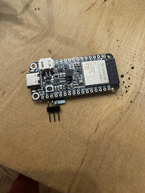

# Building the Lock

## Bill of Materials

In order to build the lock you will need:

### Mandatory parts

* [Adafruit ESP32-S3 Reverse TFT Feather - 4MB Flash, 2MB PSRAM, STEMMA QT](https://www.adafruit.com/product/5691). If you want an "official" build + badge on the coordinator, you'll need to order one from subjugated.club. Homebrew versions are totally welcome and don't limit your features.
* [STEMMA QT / Qwiic JST SH 4-Pin Cable - 50mm Long](https://www.adafruit.com/product/4399)
* [Tiny Code Reader from Useful Sensors](https://www.adafruit.com/product/5744)
* [Micro servo - TowerPro SG92R](https://www.adafruit.com/product/169) - You can also use any generic SG90/SG92 form factor servo.
* [7x Socket Head Cap Screw: M2-0.4 Thread Size, 8 mm Lg, Std, Black Oxide, Steel, Class 12.9, 100 PK](https://www.grainger.com/product/6CE33)
* [7x Hex Nut: M2-0.40 Thread, 4 mm Hex Wd, 1.6 mm Hex Ht, Steel, Class 8, Zinc Plated, 100 PK](https://www.grainger.com/product/26KR83)
* [3x Female-to-male jumper wires](https://www.amazon.com/dp/B09FPJM3L9) - Shorter the better. These are 10cm.
* Adhesive. Hot glue if you want some margin of error, superglue if you want a more "secure" experience.

### Optional, but good to have

* [Loctite Threadlocker Blue](https://www.loctiteproducts.com/products/central-pdp.html/loctite-threadlocker-blue/SAP_0201OHL029W4.html) - Makes the lock more tamper resistant.
* Tiny cable tie
* [4mm Nut driver](https://www.amazon.com/dp/B0009OIJMI?th=1) - Definitely makes tightening the nuts easier, but far from necessary. Also you probably want a magnetized one, but this is what I have.

### Tools

* Soldering iron
* Technical screwdriver (T6 bit)

## 3D Files

You can get the full kit of parts here: [Full kit](static/tartarus_parts.3mf)

I personally use Prusa slicer + the Prusa MINI+ for most builds. I use organic supports, 15% infill, and the 0.20mm SPEED profile.
Feel free to adjust as necessary. I recommend printing with PLA.

## Assembly

### Step 1: Print the parts

* 3D printer
* Several hours

### Step 2: Solder headers to ESP32-S3

* ESP32-S3 + included headers




``

Use a pair of pliers and break off 3 headers from the full strip that comes with the ESP32-S3.

You'll solder these headers (short-side through top) across 3V, GND, and A0. See picture.
Also check out the [pinout guide](https://learn.adafruit.com/esp32-s3-reverse-tft-feather/pinouts) from Adafruit.

### Step 3: Flash the firmware

`

Hold down D0 and press Reset. Flash the firmware with:
```
espflash flash --monitor --partition-table partitions.csv --no-skip --erase-parts otadata
```
If it looks like it succeeded but says "Waiting for download" you just need to reset it one more time.

You should see the boot screen followed by "Needs configuration."

We do this now because we need the firmware to calibrate the servo.

### Step 4: Assemble servo bracket

* 2x 2mm screws
* 2x hex nuts
* 1x mounting bracket
* 1x SG92 servo (with single-ended horn, and small screw that came with it) 

`

### Step 5: Wire servo to ESP32-S3.

* 3x jumper wires

`

Unfortunately, the board layout is 3V, GND, A0 and the servo's wiring is GND, 3V, Signal.
Use the jumper wires to connect the servo the board headers but swap the power and ground.

Connect USB power to the ESP32-S3 and you will probably hear a quick buzz. The servo is now
in the "down" angle position so we can mount the horn.

#### Alternative

You can also pop the pins out of the servo connector and swap them there and omit this step.

### Step 6: Mount the horn

`

Mount the horn at 6 as if it were a clock. Connect power back to the ESP32-S3 and make sure the
servo starts at 6. Toggle the lock on the second screen (D2 to change screen and then by pressing D1, the middle button). It should freely rotate
to a 3 o'clock position and back. If it does, use the small-sized screw and mount the horn permanently. Try
not to rotate the horn while tightening.

### Step 7: Mount ESP32-S3 to lid

* 4x bolts
* 4x nuts

`

`

`

`

Use a pair of tweezers (or similar) to remove the small section where the headers will fit
from the underside of the 3D print.

Attach all the bolts and nuts. Use the thread locker to make sure
they don't loosen. Also makes sure that subs can't just open it by shaking :-).

### Step 8: Wire and mount code reader

* Tiny code reader
* Stemma QT cable
* 1 bolt
* 1 nut
* 2 spacers from 3D print

`

`

`

Connect the tiny code reader with the stemma QT cable to the main board.

Mount the tiny code reader with the bolt + nut.

I use 2 "spacers" to secure the code reader in place because it only has the one
screw mount hole. I use a *tiny* amount of activator on the board and superglue
the spacers above and below the reader. See pic.

### Step 9: Test and then make wire connections permanent

Plug it in and cycle the lock. Try and scan a wifi code and make sure it connects.
When you're satisfied it's all working make the connections permanent with your
adhesive of choice.

### Step 10: Mount servo to main body

`

### Step 11: Mount technical lid to main body

`

I use a tiny cable tie to make this a little easier and a little more organized.

Use your adhesive to secure the front lid to the body.

`

### Step 12: Seal top

`

`

I use superglue on the left sill, the right sill, and a tiny bit across
the front where all the technical parts are mounted.
If you're using hot glue be sure wherever you apply it doesn't interfere with the tray sliding in and out.

In order to get the best seal I recommend leaving a heavy weight on it while it cures.
I have a tupperware full of change for this. Give it an hour or two.

### Done!

`